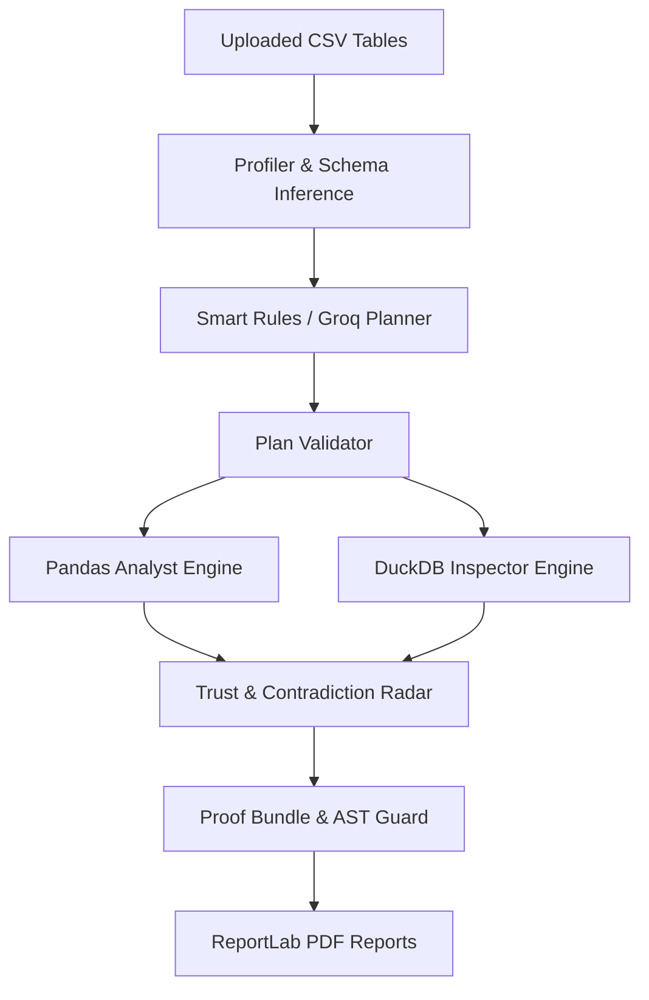

# AuditPilot: Proof-Carrying AI Data Analyst

AuditPilot is a proof-carrying AI data analyst for messy multi-table CSV business data. It answers supported business questions only when the answer can be proven.

## Architecture (Mermaid)



## Setup & Commands

1. **Install backend requirements**:
   ```bash
   pip install -r backend/requirements.txt
   ```
2. **Generate deterministic datasets**:
   ```bash
   python -m backend.data_gen.generate_data
   python -m backend.data_gen.compute_ground_truth
   ```
3. **Run tests**:
   ```bash
   python -m pytest
   ```
4. **Start FastAPI backend**:
   ```bash
   uvicorn backend.app.main:app --reload --port 8000
   ```
